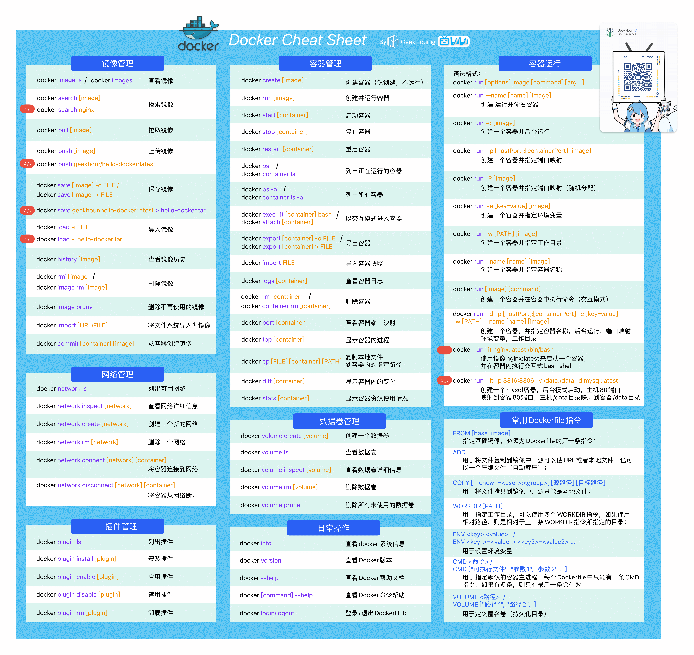

# Docker 入门

## Docker 是什么？

Docker是一个用于开发，交付和运行应用程序的开放平台。可以将操作系统、应用程序、第三方软件包、环境变量、配置文件等打包到一起，以便在任何环境中都能正确运行。

## Docker 和虚拟机的区别
有时候我们只是部署一个web服务，
 - 虚拟机提供一个完整的操作系统，包括操作系统、内核、各种系统服务，甚至是GUI。我们并不需要的这些服务占用了大量的系统资源，导致资源浪费和速度慢的问题。
 - docker提供的是容器服务，使用的是宿主机的操作系统，容器内只运行相关的应用程序，占用资源少，启动速度快。

## 客户端

负责向Docker daemon发送请求，一般有三种方式：

 - CLI命令行
 - API调用接口
 - GUI图形化界面

## 服务端

### Docker daemon
Docker服务端的守护进程，负责调度Docker的各种资源。

### Images（镜像）
可以理解为一个虚拟机的快照，里面包含了应用程序机与它相关联的所有库、软件。

### Containers（容器）
镜像的实例化运行时，一个镜像可以运行多个容器，容器之间通过沙盒机制相互独立，只能通过暴漏端口的方式与外部通信。

### Volume（数据卷）
由于销毁容器之后容器内部数据会一同销毁，Volume提供一个容器内和宿主机共享的数据集。

## Docker 命令大全

