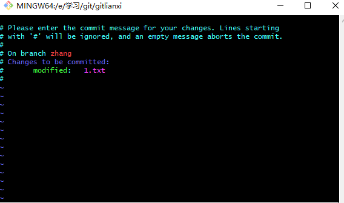

# Git入门

Git是一种分布式的版本控制系统。

::: info 
- 版本控制，顾名思义可以记录历史，并在需要时回退.
- 分布式的概念是多了一个本地仓库，每一个本地仓库都存在所有的版本，过程中无需联网提交（但是到最后还是要把代码提交到中央仓库）。
:::


## add

add的作用是把`工作区`改变的代码提交到`暂存区`，以监听文件内部的改变

```shell
git add 文件名
```

add之前：


add之后：


*文件状态由“`未跟踪`”变成“`已暂存`”*

::: warning
add添加的为文件改变而非文件本身
:::

### 快速add
暂存所有文件

```shell
git add .
```

## commit

commit的作用是将暂存区的代码提交到本地仓库。

```shell
git commit
```




执行之后进入到编辑页面，“`i`”键进入输入状态，键入提交信息后“`Esc`”返回，两个“`ZZ`”退出

### 快速commit

```shell
git commit -m 提交信息
```

## push
将本地提交到远程仓库,本质其实是将当前的分支连同它路径上的commit一并提交到远程仓库

```shell
git push 主机名 分支名
```

### 快速push
提交本地所有分支。

```shell
 git push
```

## log
commit完成之后你你就成功完成了一次提交，现在查看一下刚刚提交的commit

```shell
git log
```


这里记录了commit的SHA-1，提交的作者，提交时间

### 查看具体的log
显示详细的文件内容变动。
```shell
git log -p
```


### 查看简单的log
只显示文件变化统计。
```shell
git log --stat
```

## show

### 只查看当前commit信息

```shell
git show
```


### 查看某一条commit信息

```shell
git show SHA-1
```

### 查看某一条commit信息中的文件

```shell
git show SHA-1 filename
```

## pull

`git pull` 其实是 `git fetch` 和 `git merge` 的集合，
拉取目标branch的所有commit和当前的commit合并生成一个新的commit。

```shell
git pull 主机名 分支名
```

pull操作在一定程度上会帮你自动合并：
  - 如果一个分支改了A文件，另一个分支改了B文件，合并之后两个文件都会改。
  - 如果一个分支改了A文件第一行，另一个分支改了A文件第二行，合并之后A文件第一行和第二行也都改了。
  - **是如果一个分支改了A文件第一行，另一个分支也改了A文件第一行，这就出问题了，需要手动解决一下冲突。**

冲突解决完毕之后需要重新add、commit，这个时候发现git会自动帮我们填好了log信息，提交就可以

## branch

git和其他版本控制系统的主要区别就是git有`branch`的概念，意思翻译为分支，实质为commits的引用。

`引用`相当于commit的快捷方式，我们看到每一个`commit`都有一个SHA-1的加密值，这个值重复率极低，低到我们可以用前几个值来代替，比如我们可以用`7800ba`来代表上一次的commit，后面的`HEAD -> master`，`github/master`也是指向这个commit的引用。


### HEAD：当前分支的引用

当前分支的引用指的是`当前工作目录`对应的`commit`，当你有提交的时候，HEAD也会自动指向当前的`commit`。总之，当前`commit`在哪里，`HEAD`就在哪里，你永远可以用`HEAD`来操作当前`commit`

### branch：分支

`HEAD`除了可以引用`commit`，也可以引用一个`branch`，在指向`branch`的时候，间接的指向了对应的`commit`，当前分支被提交的时候，`HEAD`拉着对应的`branch`一起移动。

### main：默认branch

main分支是项目在被clone下来的时候默认创建的。

::: tip
所有的branch都是平等的。
:::

### branch的操作

#### 创建branch

```shell
git branch 分支名
```

#### 切换branch

```shell
git checkout 分支名
```

这样是不是有点麻烦，我们可以把两步合在一起：
创建一个分支并立即切换过去。
```shell
git checkout -b 分支名
```

#### 删除branch

```js
git branch -d 分支名
```

::: danger
1. 删除时要切换到其他branch进行删除
2. 删除branch只是删除commit的引用，所在branch的提交并没有删除
3. 没有合并过master的分支删除失败（出于安全考虑），换成大写`-D`就可以了
:::

## 工作流:Feature Branching

市面上最流行的工作流

1. 假如有一个项目需要你开发功能，于是你在项目上新建了一个分支

```shell
git checkout -b zhang
```

2. 开发完毕之后你可以推送到远程分支上去：

```shell
git push origin zhang
```

3. 然后你告诉同事说可以review一下你的代码，同事说可以，所以你同事就：

```shell
git pull
git checkout zhang
```

4. 同事说看了没问题，可以合并到master。 于是你就把zhang合并到master上去。 如果同事说有问题，你可以修改代码重复流程`2`。

```shell
git checkout master
git pull
git merge zhang
```
最后推送到远程仓库并删除本地/远程分支：

```shell
git push
git branch -d zhang
git push origin -d zhang
```
